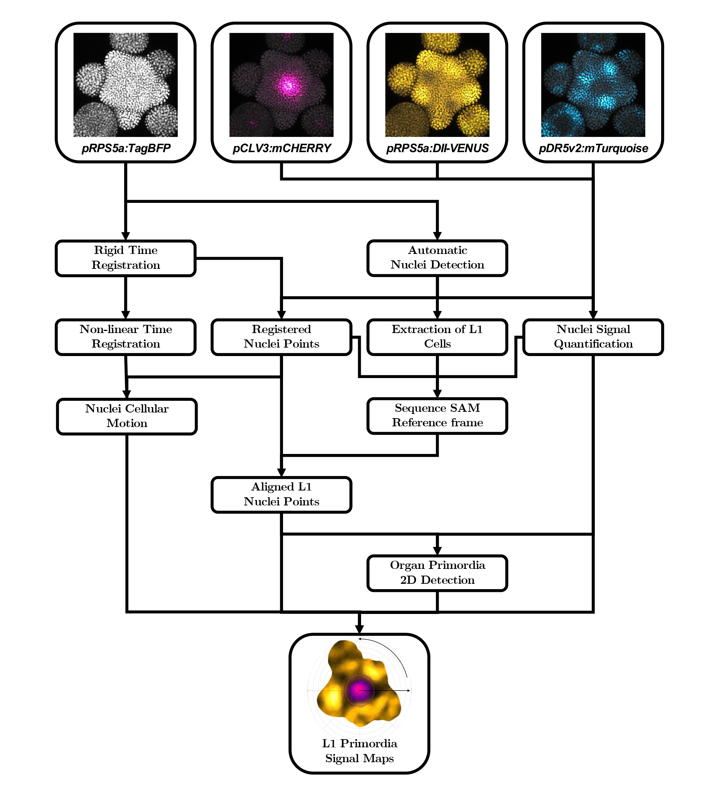

.. toctree::
   :maxdepth: 2

.. _script-alignment:

################################################################################
SAM Sequence Detect, Quantify & Align
################################################################################

.. code-block::

       sam_experiment_detect_quantify_and_align

Arguments
---------

  -h, --help                                                Show this help message and exit
  -e EXPERIMENTS, --experiments EXPERIMENTS                 List of experiment identifiers
  -dir PATH, --data-directory PATH                          Path to SAM sequence data files directory (nomenclature, orientation...)

  -Mdir PATH, --microscopy-directory PATH                   Path to CZI image directory [default : data_directory/microscopy]

  -a, --all                                                 Run all the detection and alignment steps
  -o PATH, --output-directory PATH                          Path to detected nuclei directory [default : data_directory/nuclei_images]

  -D, --detection                                           Run nuclei detection on all experiments
  -s, --save-channels                                       Save INR image files for each microscopy image channel
  -R, --registration                                        Run sequence image registration on all experiments
  -i PLOT_TYPE, --image-plot PLOT_TYPE                      List of image projections types to plot [sequence_raw,sequence_registered,sequence_aligned,sequence_primordia,experiment_aligned,experiment_primordia,all_aligned,all_primordia,...]
  -p PROJECTION_TYPE, --projection-type PROJECTION_TYPE     Projection type for the image plots {max_intensity,L1_slice}
  -n PLOT_TYPE, --nuclei-plot PLOT_TYPE                     List of signal map types to plot [sequence_raw,sequence_registered,sequence_aligned,sequence_primordia,experiment_aligned,experiment_primordia,all_aligned,all_primordia,...]
  -m PLOT_TYPE, --map-plot PLOT_TYPE                        List of signal map types to plot [sequence_raw,sequence_registered,sequence_aligned,sequence_primordia,experiment_aligned,experiment_primordia,all_aligned,all_primordia,...]
  -N, --normalized                                          Display normalized signals when plotting
  -pol, --polar                                             Compute maps using polar coordinates
  -G, --growth-estimation                                   Estimate tissue-scale growth on all experiments
  -g GROWTH_TYPE, --growth-type GROWTH_TYPE                 Whether to estimate surfacic or volumetric growth information {surfacic,volumetric} [default: surfacic]
  -P, --primordia-alignment                                 Align sequences of all experiments based on the detection of CZ and P0
  -C, --data-compilation                                    Compile all the data from the experiments into .csv files in the data directory
  -v, --verbose                                             Verbose
  -d, --debug                                               Debug